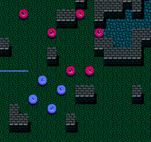

# tactics
> minimalistic tactical rpg

[play the demo][demo]

[][demo]

a small [trpg] inspired by [fire emblem]. i've attempted to remove any and all elements that hamper strategic gameplay in favor of determinism and semi-perfect information a la chess, so no RNG-based combat or unexpected reinforcements. predictable AI and RPS-style unit interactions are still alive and well however.

happy refreshing!

## controls
* arrow keys/`WASD`: move cursor
* `spacebar`: select units and confirm actions
* `escape`: cancel current action
* `tab`: cycle through units or options

## install
```sh
$ git clone git@github.com:semibran/tactics.git
...
$ cd tactics
$ npm i
$ make
```

finally, open `dist/index.html` using a reload server of your choice to avoid CORS restrictions

[demo]:        https://semibran.github.io/tactics
[trpg]:        https://en.wikipedia.org/wiki/Tactical_role-playing_game
[fire emblem]: https://en.wikipedia.org/wiki/Fire_Emblem
